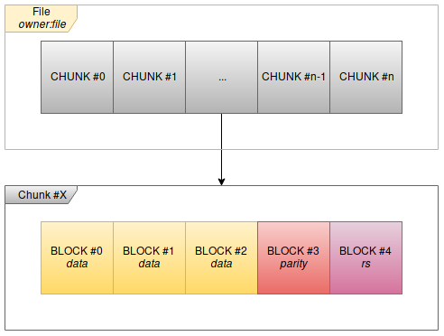
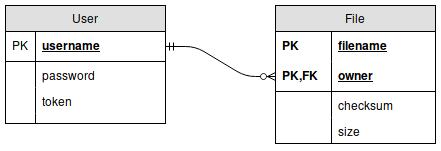

# Dropboxish

2nd practical assignment - Distributed System - FCUP 2017-2018

Satyan JACQUENS

## Description

The goal of this project is too create a pseudo-Dropbox. Using CLI, the client can upload, list and download files to the cloud.

Those files are divided into chunks which are then divided into blocks. Along with those data blocks, parity blocks are added.

Those blocks are finally save into several pools. Depending on the number of pools the following algorithms are used:

* < 4 pools: RAID 5 style, with only 1 parity blocks. 1 missing block can be retrieved.
* >= 4 pools: RAID 6 style, one parity block and one Reed Solomon blocks. 2 missing blocks can be retrieved.

## Communications

As you can see below:

* The client uses the app's REST API.
* The app and controllers use GRPC.
* The controllers and pools use GRPC.

## Pools

A pool simply store and retrieve blocks. Blocks are store in the pool file system.

## Controllers

A controller handles the files uploaded by the user. He divide it into chunks and then into blocks with FEC blocks and then upload them randomly to the pools and keep a mapping of client/files/chunks/blocks.
Each file mapping is save into a map. The key is "owner:filename".

### Operations

#### Put file

Notes:

* *k* is the number of pools.
* Operations below are operations in the Galois Field 2^8
  * '\+' is the XOR
  * '\-' is the XOR
  * '.' is the multiplication in the Galois Field.
  * *g* is the generator, here it's 29
* The following paper was used: [The mathematics of RAID-6 - *H. Peter Anvin*](https://www.kernel.org/pub/linux/kernel/people/hpa/raid6.pdf)

1. The controller checks if the file already exists and if the checksum is the same otherwise:
1. The file is divided into chunks {C0, C1, ..., C*n*}, each chunk is identified by its checksum.
    1. The chunks are divided into blocks {B0, B1, ..., B*k*}, each block is identified by its checksum.
        1. A parity block is computed, P

            P = B0 + B1 + ... + BK
        1. If *k* >= 4, a Reed-Solomon block is computed, Q

            Q = *g*^0.B0 + *g*^1.B1 + ... + *g*^*k*.B*k*
1. The blocks are uploaded to the pools. The destination of each block is saved. The blocks are randomly store into pools.

#### Get file

To get a file, the controller simply use it's map and retrieve each block from the corresponding pool. Depending on the number of initial pool, if one or two pools are offline, the controller can still recreate the data blocks and thus send the file to the app.

#### Delete file

The controller use its map to remove the blocks from the pools and finally remove the file of the map.

**Stupid limitation:** if two clients store exact the same file, blocks which are stored in the same pools will be removed...

### JGroups

A certain number of controllers are running at the same time and share the files map. Only the leader receive the app's requests and then propagate the information to the others running controllers.
Each controller save the map to a local file. (simple serialization)

#### Leader algorithm

The leader is simply the first member of the JGroups.
The leader receive app's request and followers:

* Receive leader's update
* Check every 100 ms if the leader is still online

If the leader is offline, the new first member become the leader.

#### State

The state is simply the files map.

**Missing feature:**
The date of the last operation on the files map is saved. A missing feature is when a new leader is elected to compare it's files map date with the others and abandon leadership if it's not the latest.

## App

The app save into a SQLite database the registered users and the stored files.

### JSON Web Tokens

User registers using a password and a user name. A token is then generated and sent to the user. This token contains an expiration date. Each requests sent by a user must contains an authentication header containing this token.

### Database

### Communication with controllers

The app use GRPC to communicate with the controllers.
At the beginning, the app subscribe to every controller using the leader stream. When a controller become the leader, he send a leader message to its subscribers.

If a controller disconnect, the app will try to reconnect to it every 200ms.

This way the application is always aware of who is the leader.

### Rest API

| URL        | Verb           | Arguments  | Result |
| ------------- | ------------- | ----- |-|
| /user/login | POST | *username*, *password* | Retrieve the JSON Web Token|
| /user/register| POST |*username*, *password* | Create a new user if *username* isn't already used |
| /file/list| GET |*query* (facultative) | List files (matching *query*) for the user |
| /file/delete| DELETE |*filename0 filename1 filename3 ...* | Remove files |
| /file/upload | POST | *file* (Multi-part) | Upload a file |
| /file/download | GET |*filename* | Download the file named *filename* |

## Client

When the client is launched, the client need to connect.

### Commands

#### Authentication

* login **USERNAME**

    Log to the application (retrieve and save the token)
* register **USERNAME**

    Register a new account to the application
* exit

    Exit the application

#### Files

* upload **FILE**

    Upload a file to the cloud
* download **FILE** [**DEST**]

    Download **FILE** from the cloud.
    Put it in the current directory or in **DEST**.
* list

    List available files (both locally and in the cloud)
* search **PATTERN** [**PATTERN2**...]

    Search file whose name contains **PATTERN**
* ls [**OPTION**]... [**FILE**]...

    Call GNU *ls* command.
* remove **FILENAME** [**FILENAME2** **FILENAME3**...]

    Remove a file from the cloud
* exit

    Exit the application
